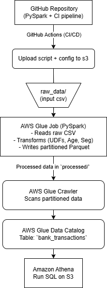

# Bank Transaction Data Pipeline (AWS Glue + PySpark + Athena)

This project demonstrates a production-ready data pipeline built on AWS using PySpark, Glue, and Athena. It ingests bank transaction data from S3, transforms and enriches it with PySpark, writes clean Parquet outputs, and registers them in the Glue Catalog for SQL querying via Athena.

---

## Tech Stack

- **PySpark** — for transformations and aggregations
- **AWS Glue** — serverless Spark-based ETL engine
- **S3** — storage for raw and processed data
- **Glue Crawlers & Data Catalog** — schema discovery and metadata
- **Athena** — serverless SQL on S3
- **GitHub Actions** — CI/CD pipeline for testing and deployment

---

## Project Structure

bank-data-pipeline/<br>
├── scripts/ # PySpark Glue job scripts<br>
│ └── bank_glue_etl_job.py<br>
├── configs/<br>
│ └── job_params.json # Glue job input/output paths<br>
├── tests/<br>
│ └── test_transforms.py # Unit tests for UDFs and transforms<br>
├── .github/workflows/<br>
│ └── glue-ci.yml # CI/CD pipeline<br>
├── requirements.txt<br>
├── README.md<br>
├── .pre-commit-config.yaml<br>
├── bank-etl.png

---

## Pipeline Flow

1. **Upload** raw CSVs to S3 (e.g., `s3://s3-bucketname/raw/`)
2. **Trigger Glue job** via CI/CD
3. **PySpark transforms**:
   - Calculate customer age
   - Segment customers (`Youth Low`, `Senior High`, etc.)
   - Add total transaction spend per customer
   - Remove invalid rows
4. **Write Parquet** to `s3://s3-bucketname/processed/`, partitioned by `CustLocation` and `Segment`
5. **Glue Crawler** discovers schema and adds table to Glue Catalog
6. **Athena** is used to query the processed data with SQL

---

## Features

- Clean, testable PySpark code
- UDFs for customer segmentation
- Window functions for running totals
- Partitioned Parquet output
- CI/CD with linting, unit tests, and S3 deployment
- Pre-commit hooks for local dev hygiene

---

## Example Athena Query

```sql
SELECT CustGender, COUNT(*) AS txn_count
FROM bank_transactions
WHERE segment = 'Youth Low' AND custlocation = 'Karnataka'
GROUP BY CustGender;
```

---

## CI/CD Highlights

- GitHub Actions triggers on main branch merges
- Runs black, flake8, pytest
- Uploads ETL script and job config to S3
- Uses GitHub Secrets for AWS credentials

---

## Testing
Unit tests validate:
- UDF logic (customer_categorization)
- Age and transaction transforms
- DataFrame schema and content using chispa

---

## Architecture Diagram



